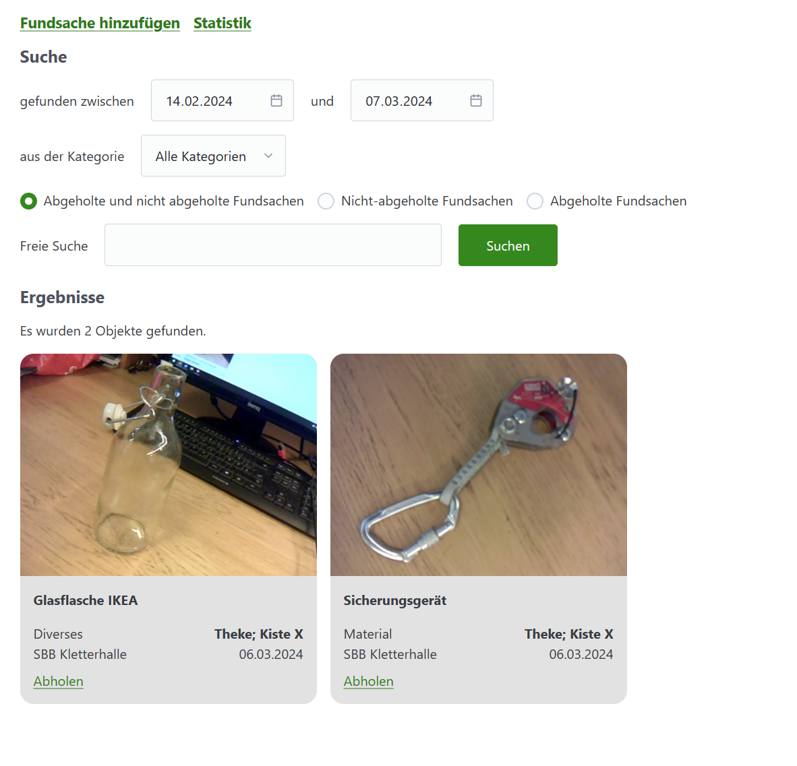

# SBB Fundachen Webapp


## Quickstart
### Frontend
The frontend uses react with typescript and vite.
```bash	
npm install
npm run dev
```

### Backend
The backend uses [Pocketbase](https://pocketbase.io/).
Donwload it and run it with:
```bash
pocketbase serve
```
Now open the admin ui, create an admin user and import the pb_schema.json file.

